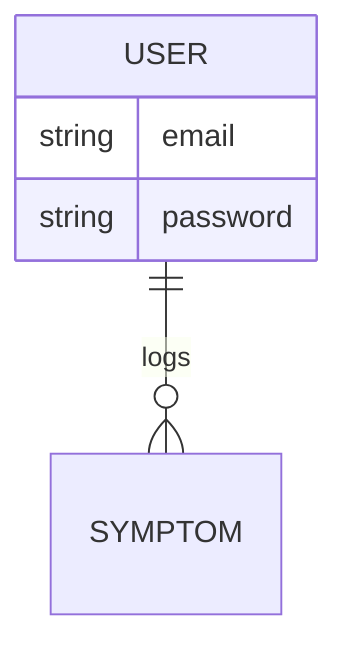

# Orange Server
A REST API server created with Express
> How might we improve equity and access to mental healthcare in rural areas?

## 🔗 Links
- [Client Repo](https://github.com/orange-squad/orange-client)

## API Routes
### 🔒 Authentication
Method | URI                | Status          | Description          |
------ |------------------- | --------------- | -------------------- |
POST   | `/sign-up`         | 201, Created    | sign up user         |
POST   | `/sign-in`         | 201, Created    | sign in user         |
PATCH  | `/change-password` | 204, No content | change user password |
DELETE | `/sign-out`        | 204, No content | sign out user        |

## ER Diagram

[Mermaid Syntax Reference](https://mermaid-js.github.io/mermaid/#/n00b-syntaxReference)
